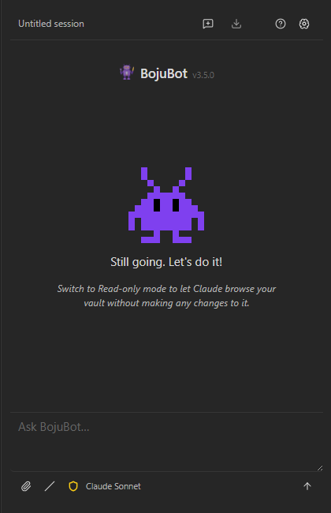
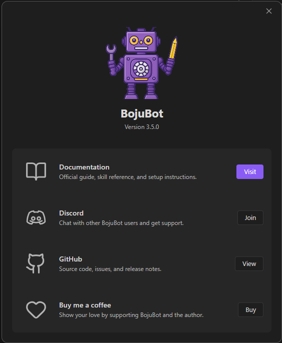
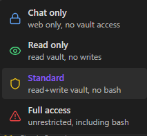

# Chat Panel

The chat panel opens as a sidebar. Type your message and press **Enter** to send. Use **Shift+Enter** to insert a newline without sending. 

If you would prefer to exclusively use the **Up Arrow** icon to send messages rather than the **Enter** key, the "Send on Enter" behavior can be toggled in **Settings → BojuBot → Send On Enter**.

In **Standard** permissions mode, Claude has access to your full vault — it can read, write, create, move, and organize notes. The vault root is Claude's working directory.  You can confirm this by typing, "What is your current working directory?"

---

## Welcome Screen

Starting a new session (or opening the panel with no active conversation) shows a welcome screen: BojuBot's mascot, a greeting, a tip of the day, and — once you have past conversations — a **Recent sessions** list of up to three, click any to resume. Click the mascot to open the [About dialog](#about-dialog).


---

## About Dialog

Open the **About DIalog** by clicking the **About BojuBot** icon in the toolbar, or by using the the **BojuBot: About** command. 
 
 

## Attaching Context

Attached items appear in a bar above the input field. Click **×** to remove an item, or the **pin icon** to keep it attached for every subsequent message in the session.
### @-mention a note

Type `@` anywhere in the input to open an autocomplete dropdown.  Press **Enter** to attach it the highlighted note. Start typing to filter by name. Press **↑ / ↓** to navigate, **Enter** or **Tab** to select, **Escape** to dismiss. The full contents of the selected note are prepended to your message.

Non-Markdown files show their extension in the dropdown. By default all vault files are included. To restrict to specific types, change **@-mention file types** in [Settings](./settings.md).

### Attachment button (paperclip)

| Option          | What it does                                                                                                                                                      |
| --------------- | ----------------------------------------------------------------------------------------------------------------------------------------------------------------- |
| **Attach file** | Opens your system file picker. Text files (`.md`, `.txt`, `.js`, etc.) are read inline. Images and PDFs are copied to a temporary folder so Claude can read them. |
| **Attach URL**  | Passes a URL to Claude as-is. Claude fetches or references it based on your message.                                                                              |
| **@ Add note**  | Opens the same vault note search as the `@` shortcut.                                                                                                             |

### Paste from clipboard

Paste images directly with **Ctrl+V** / **Cmd+V**:

- **Screenshots** — take a screenshot, paste into BojuBot
- **Files from Explorer/Finder** — copy a `.png`, `.jpg`, `.gif`, `.webp`, or `.pdf` and paste

Pasted images appear in the context bar. They're saved to `.obsidian/plugins/bojubot/tmp/` and are not automatically cleaned up.

### Drag and drop

Drag any file from your filesystem and drop it onto the BojuBot panel. The panel highlights with a dashed border while dragging. Text files are read inline; images and PDFs are handled the same as the file picker.

### Send selected text

Highlight text in any open note, then run **BojuBot: Send selection as context** from the Command Palette (or bind it to a hotkey). The selection is attached as a labeled snippet.

---

## Permission Icon

Click the colored **Permission Icon** in the input toolbar to open a quick picker and switch the permissions mode:



The change takes effect on the next message. See [Permissions](./permissions.md) for details on what each mode allows.

---

## Model Indicator

The **model name** shown in the input toolbar (e.g. *Claude Sonnet*) reflects the active Claude model. Click it to open the model picker and switch to a different model.

| Model         | Best for                         |
| ------------- | -------------------------------- |
| Claude Haiku  | Fast responses, simple tasks     |
| Claude Sonnet | Balanced speed and capability    |
| Claude Opus   | Complex reasoning and long tasks |
| Claude Fable  | Long-running agents              |

Switching models starts a **new session** — the current conversation cannot continue with a different model. The selected model persists across restarts.

You can also switch via `/model` in the slash menu or **BojuBot: Switch model** in the Command Palette.

To add models not in the built-in list, see [Custom models](./settings.md#custom-models) in Settings.

---

## Context Gauge

A **ring icon** appears in the input bar after your first message. Hover to see how much of the 200K token context window remains. Click it to manually compact the session history if it's filling up.

---

## Tool Call Visibility

While Claude is working, tool calls appear above the response bubble in real time — you can see what Claude is reading, writing, or searching. When the response completes, the tool list collapses to a single toggle line. Click to expand or collapse.

---

## Running Obsidian Commands

Claude can execute Obsidian commands directly. Three are pre-approved by default:

| Command                   | ID                   |
| ------------------------- | -------------------- |
| Quick switcher            | `switcher:open`      |
| Daily notes: Open today's | `daily-notes`        |
| Search current file       | `editor:open-search` |

You can manage the full list in **Settings → BojuBot → UI Bridge & Commands**.

### How permission works

| Situation                                     | What happens                                              |
| --------------------------------------------- | --------------------------------------------------------- |
| Command in **allowlist**                      | Runs immediately                                          |
| Command **not** in allowlist (prompt mode on) | Modal appears: Allow or Deny, with **Don't ask again**    |
| Allow + Don't ask again                       | Runs and added to allowlist permanently                   |
| Deny + Don't ask again                        | Added to denylist — future attempts silently blocked      |
| Command in **denylist**                       | Silently blocked (add to allowlist to re-enable)          |
| Prompt mode off                               | Unlisted commands hard-blocked with an explanatory notice |

---

## Opening & Navigating Files

Claude can open a note directly in your workspace as part of its response — for example, after creating or finding something you'll want to look at:

| Behavior             | What happens                                          |
| --------------------- | ------------------------------------------------------ |
| Open in current pane  | Replaces what you're currently viewing                 |
| Open in a split       | Side-by-side, doesn't disturb your current view        |
| Open in a new tab     | Stacked tab — doesn't replace or split anything         |
| Jump to a heading     | Opens the file and scrolls to a specific heading        |

All of these are immediate — no confirmation needed — and Claude posts a short notice each time, so you always know what changed.

---

## Other Actions

A few smaller things Claude can do as part of a conversation:

- **Change how it addresses you (or itself)** — just say so, e.g. *"Call me Alex from now on"* or *"I'd rather you go by a different name."* Persists across sessions.
- **Request permission** — if a task genuinely needs a capability your current permission mode blocks (e.g. Bash access in Standard mode), Claude can ask instead of giving up silently. You decide via the denial card on your next message — see [Permission Denials](./permissions.md#permission-denials).
- **Open Settings** or **the quick switcher** — Claude asks first in chat text, waits for you to confirm, then acts on your next message. Never fires without that round-trip.

---

## File Operations

Claude can rename, move, and delete vault files through Obsidian's own API rather than the filesystem directly — so wikilinks and embeds pointing at the file update automatically instead of breaking.

- **Delete** moves the file to trash per your vault's configured trash preference (system trash or `.trash/` folder) — it's not a permanent delete.
- Requires **Standard** or **Full access** permission mode. In Chat only or Read only mode these are no-ops — the current mode doesn't allow vault writes, so nothing happens (with a notice explaining why).

---

## Example Prompts

```
"Summarize the note [[Project Alpha]]"
"Find all notes tagged #meeting from last week and create a summary"
"Rename all notes in 03_Cards that start with 'Untitled' based on their content"
"Open today's daily note"
"Refresh the Dataview on this page"
"Create a new note from my Project template"
```
