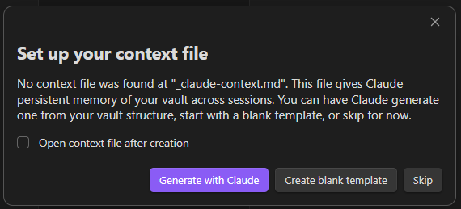

# First Launch

After enabling the plugin:

- A **brain-circuit icon** appears in the left ribbon — click it to open the BojuBot chat panel
- Or use the Command Palette (`Ctrl+P` / `Cmd+P`): **BojuBot: Open agent panel**

::: tip Claude not found?
If BojuBot can't find your Claude Code installation, a setup panel will appear. Either follow the on-screen steps to install Claude Code, or enter the full path to your `claude` binary in **Settings → BojuBot**.
:::

The first time BojuBot doesn't find a context file, a setup dialog offers to generate one with Claude, start from a blank template, or skip — see [Context File](./context-system#3-context-file-persistent-memory) for details. 

Every new session also shows a brief welcome screen (mascot, greeting, tip of the day, recent sessions) — see [Welcome Screen](./chat-panel#welcome-screen).

Once the panel opens, type a message and press **Enter**. Your context file (if you have one) is injected at the start of each session so Claude isn't starting blind.

**Try these to get a feel for it:**

- *"Tell me about yourself"
- *"Summarize the note [[Home]]"*
- *"What notes do I have tagged #meeting from last month?"*
- *"Create a new note in 'Planning' called 'Q2 Goals' with a bullet outline"*

---

Next: [Using the Chat Panel →](./chat-panel)
